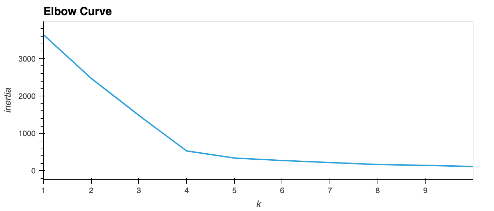
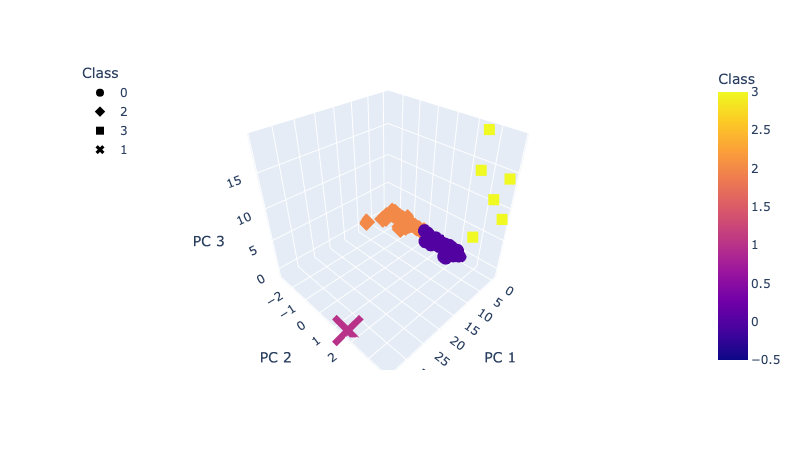
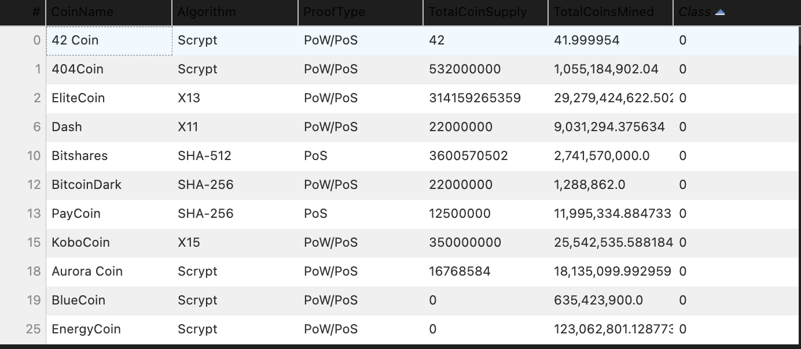
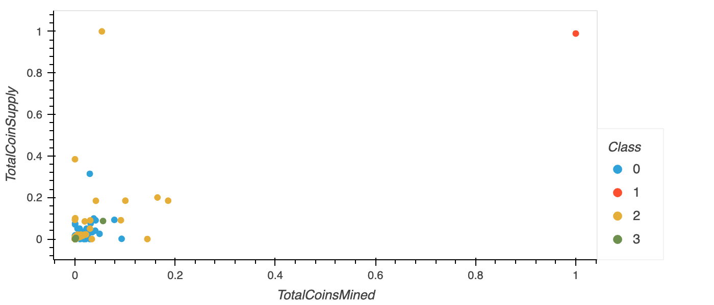

# Crypto_Currencies

# Overview

A prominent investment bank, is interested in offering a new cryptocurrency investment portfolio for its customers and hence trying to analyze the vast universe of cryptocurrencies. To accomplish this task effectively and as there is no known output, data analytics team is deploying "Unsupervised machine learning" algorithm to create a report on available cryptocurrencies on the trading market and how they could be grouped to create a classification system.

# Results

Following the preprocessing and cleaning phase we have a total of 532 tradable cryptocurrencies.

## Clustering Cryptocurrencies using K-Means (Elbow Curve)

We don't know what would be the output of the analysis so we are using unsupervised machine learning to identify clusters of the cryptocurrencies.
We produced the elbow curve below using the K-Means method iterating on k values from 1 to 10.

</img>

The best k value appears to be 4 so we would conclude on an output of 4 clusters to categorize the crytocurrencies.

## Visualizing Cryptocurrencies Results

</img>

This 3-D scatter plot was obtained using the PCA algorithm to reduce the crytocurrencies dimensions to three principal components.

### Tradable Cryptocurrencies Table

</img>

Most of the cryptocurrencies are part of class #0 and #1.

### 2D - Scatter plot with TotalCoinMined vs TotalCoinSupply

</img>

Plotting the scatter plot from two cryptocurrency features directly does not efficiently segregate the different classes. Then using the PCA algorithm is the right method for better visualizations.

## Summary 

We have identified the classification of 532 cryptocurrencies based on similarities of their features.
Particularities of each group need to be analyzed to determined their performance and potential interest for the investment bank's clients.